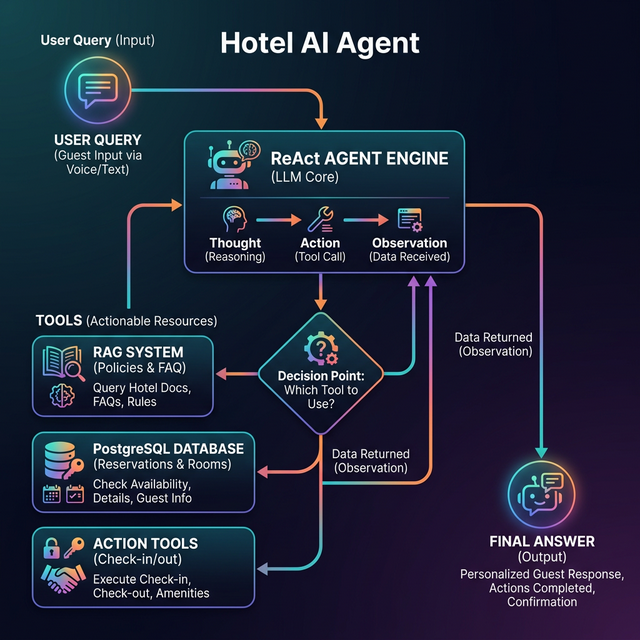
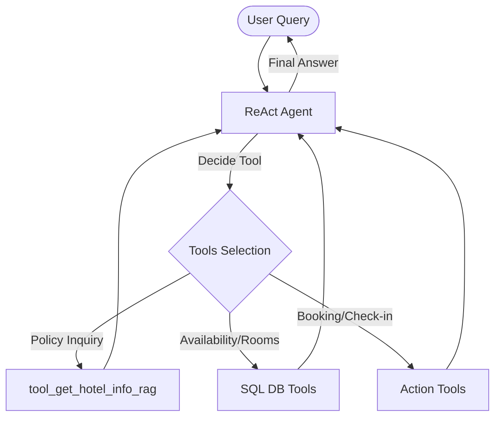

# Chatbot for Hotel Reservations

This agentic chatbot uses LangGraph and modern AI technologies to interact with a PostgreSQL database and a Qdrant vector database. It leverages RAG (Retrieval-Augmented Generation) to provide accurate answers about hotel policies, services, and FAQs.

## 🚀 Installation

This project uses [Poetry](https://python-poetry.org/) for dependency management.

```bash
# Clone the repository (if applicable)
# cd hotel_agent

# Install dependencies
poetry install

# Activate the virtual environment
poetry shell
```

## 🛠️ Setup & Requirements

### 1. Environment Variables
Create a `.env` file in the root directory with the following variables:
```env
OPENAI_API_KEY_TOKEN=your_openai_api_key
MY_QDRANT_HOST=localhost
MY_QDRANT_PORT=6333
VECTOR_BD_NAME=hotel_rag

DB_HOST=localhost
DB_PORT=5432
DB_NAME=hotel_db
DB_USER=hotel_user
DB_PASSWORD=hotel_password
```

### 2. Databases
- **PostgreSQL**: Ensure your database is running and the schema is loaded (see `script_hotel_bd_agent.sql`).
- **Qdrant**: Run the vector database using Docker:
```bash
docker run -p 6333:6333 qdrant/qdrant
```

## 🧠 RAG Knowledge Base

The RAG system uses PDFs located in `data/pdf/` to answer questions about:
- Hotel policies
- Guest services
- Frequently Asked Questions (FAQ)

### Step 1: Ingest Documents
Before running the agent, you must index the PDFs into the vector database. This only needs to be run once or when the PDFs change.
```bash
export PYTHONPATH=$PYTHONPATH:.
python3 app/rag/ingest.py
```

### Step 2: Run the Agent
Run the main entry point to start the chatbot.
```bash
python3 app/agent/workflow.py
```

## 🏗️ Project Architecture

```text
hotel_agent/
├── app/
│   ├── agent/          # LangGraph logic and tools
│   │   ├── tools.py
│   │   └── workflow.py
│   ├── database/       # DB connection and SQL queries
│   │   ├── connection.py
│   │   └── queries.py
│   ├── rag/            # RAG Pipeline
│   │   ├── loader.py       # PDF Loading
│   │   ├── splitter.py     # Text chunking
│   │   ├── embeddings.py   # OpenAI Embeddings
│   │   ├── vectorstore.py  # Qdrant interactions
│   │   ├── retriever.py    # Search logic
│   │   ├── ingest.py       # (NEW) Ingestion script
│   │   └── pipeline.py     # Retrieval & Generation
│   ├── config.py       # Configuration loader
│   └── llm.py          # LLM Factory
├── data/
│   └── pdf/            # Document source for RAG
├── .env                # Environment variables
├── pyproject.toml      # Poetry dependencies
└── README.md
```

## 🔄 Workflow Logic

Este proyecto utiliza el patrón **ReAct (Reasoning and Acting)** a través de LangGraph para decidir qué herramienta utilizar según la consulta del usuario.



### Diagrama de Flujo (Mermaid)



---
*Developed by wildr.10*
